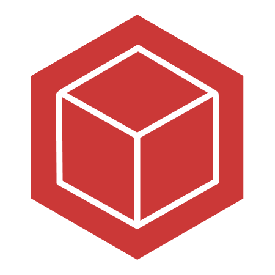

# Node Dependencies Beta

**Tree view of all dependencies installed in workspace.**

<!--  -->

  
 
_Screenshot from unpublished version. Made with [Gifski](https://gif.ski/)._
  

## Features
List of essential features. See [docs](https://github.com/tscpp/node-dependencies/blob/1.1.0/docs/docs.md) for all listed features and instructions.

- **Viewing tree view of all dependencies.**
  The extension features viewing the whole tree of all dev dependencies, dependencies, and the sub dependencies or children.
- **Installing/deleting/modifying dependencies.**
  The extension offers features like installing, deleting and modifying - changing version, changing dependency type, or updating dependency to latest master version.
- **Multiselection support.**
  When many dependencies are selected, you can delete, modify - updating dependency to latest master version, the items.

## Contributing
Feel free to contribute. Read more at [CONTRIBUTING.md](https://github.com/tscpp/node-dependencies/blob/master/CONTRIBUTING.md).

  

This repository uses [Semantic Versioning 2.0.0](https://semver.org/spec/v2.0.0.html).

Copyright (c) 2020 Elias Skogevall

Permission is granted, free of charge, to any person obtaining a copy
of this software and associated documentation files (the "software"), to deal
in the software without restriction, including without limitation the rights
to use, copy, modify, merge, publish, distribute, sublicense, and sell
copies of the software, and to permit persons to whom the software is
furnished to do so, subject to the following conditions:

The above copyright notice and this permission notice shall be included in all
copies or substantial portions of the software.

The software is provided "as is", without warranty of any kind, express or
implied, including but not limited to the warranties of merchantability,
fitness for a particular purpose and non-infringement. In no event shall the
authors or copyright holders be liable for any claim, damages or other
liability, whether in an action of contract, tort or otherwise, arising from,
out of or in connection with the software or the use or other dealings in the
software.

| Permissions    | Conditions                   | Limitations  |
|----------------|------------------------------|--------------|
| Commercial use | License and copyright notice | No liability |
| Distribution   |                              | No warranty  |
| Modification   |                              |              |
| Private use    |                              |              |
