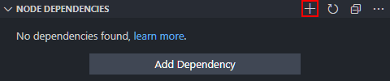
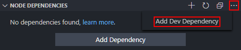
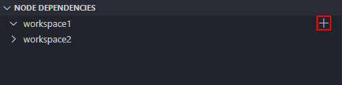
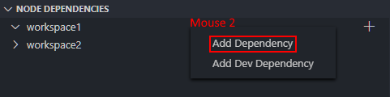
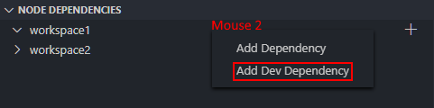
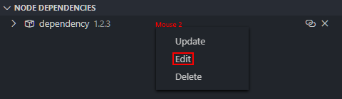
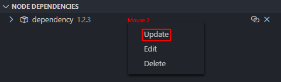
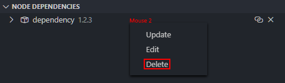
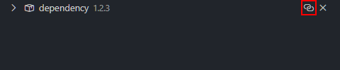

# Node Dependencies
**Tree view of all dependencies installed in workspace.** Node Dependencies is an extension for [visual studio code](https://code.visualstudio.com/) or [VS Code for short](https://code.visualstudio.com/), it manages dependencies and displays them in a tree view. The tree view will automatically update the tree view.

**Note!** The guide images were not taken with the default color theme. It may look different in VS Code for you.

### Table of Contents
- [Dependency](#dependency)
- [Dev dependency](#dev-dependency)
- [Installing dependencies](#installing-dependencies)
- [Installing dev dependencies](#installing-dev-dependencies)
- [Editing dependencies](#editing-dependencies)
- [Updating dependencies](#updating-dependencies)
- [Deleting dependencies](#deleting-dependencies)
- [Visiting depedencies in NPM](#visiting-dependencies-in-npm)

## Installing dependencies
Dependencies is through [npm](https://www.npmjs.com/). Use the plus icon on the view's title and type the packages to install.

### Installing dev dependencies
Use the menu icon on the view's title and choose 'Add Dev Dependency' from the dropdown list and type the packages to install.

### Installing dependencies in workspace
Use the plus icon on a workspace item and type the packages to install.

<!--  -->

### Installing dev dependencies in workspace
Use the secondary mouse button, a.k.a. right-click on a workspace item and choose 'Install Dev Dependency' in the dropdown list and type the packages to install.

## Editing dependencies
Use the secondary mouse button, a.k.a. right-click on a dependency item and choose 'Edit,' then edit the package version or dismiss with `ESC` and choose dev- or dependency.

### Updating dependencies
Use the secondary mouse button, a.k.a. right-click on a dependency item and choose 'Update' to update the package to the latest master version.

### Deleting dependencies
Use the delete icon on a dependency item to uninstall the package.

## Visiting dependencies in NPM
Use the visit icon or right-click on a dependency item to open the package in [npmjs.com].

[npmjs.com]: https://npmjs.com/